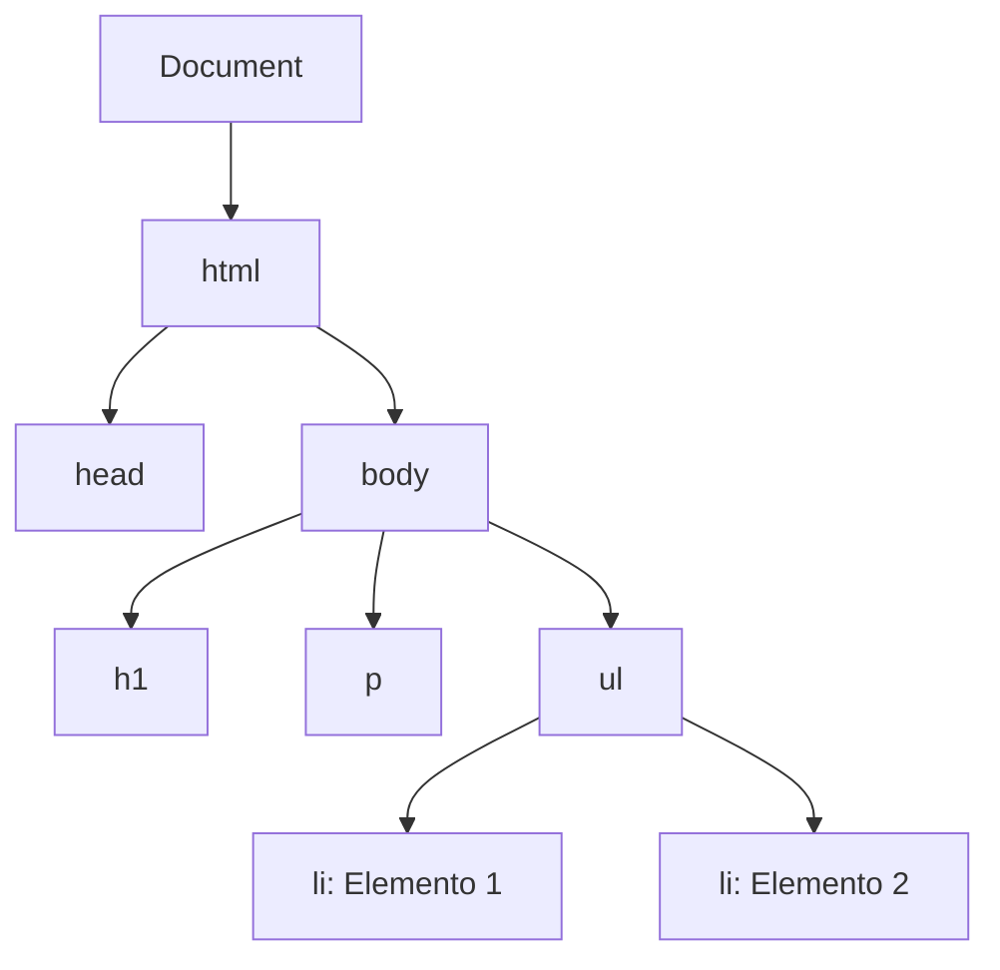

Si HTML nos permitió dibujar los planos de nuestra casa y CSS decorarla, ahora llega el momento de instalar la electricidad y los electrodomésticos.  
Con JavaScript vamos a dar vida a nuestras páginas: ya no serán estáticas, sino que reaccionarán a la interacción del usuario.

Cuando usamos JavaScript entramos en el paradigma imperativo: dejamos de decir *qué queremos* y empezamos a dar instrucciones precisas: “Crea este elemento, ponle este texto, añádelo aquí, escucha si el usuario hace clic…”. Un enfoque poderoso, pero también más complejo.  

---

## Cómo Enlazar tu Código JavaScript

Para que tu código JavaScript pueda interactuar con tu HTML, primero debes enlazarlo. Tienes varias formas de hacerlo, cada una con sus ventajas.

### 1. Script Externo (La mejor práctica)

La forma más común y recomendada es mantener tu código en un archivo separado con extensión `.js` y enlazarlo desde el HTML.

```html
<!DOCTYPE html>
<html>
<head>
  <title>Mi Página</title>
</head>
<body>
  <!-- Contenido de la página -->

  <script src="mi-script.js"></script>
</body>
</html>
```

:::tip 
**¿Por qué al final del `<body>`?**

Colocar el `<script>` justo antes de cerrar la etiqueta `</body>` asegura que el navegador haya cargado y construido todo el DOM de la página antes de intentar ejecutar el JavaScript. Si tu script intenta manipular un elemento que aún no existe, ¡dará un error!
:::

### 2. Script Interno (Inline)

Puedes escribir tu código JavaScript directamente dentro de una etiqueta `<script>` en tu archivo HTML. Es útil para pruebas rápidas o scripts muy pequeños, pero no es ideal para código complejo.

```html
<button onclick="saludar()">Haz clic</button>

<script>
  function saludar() {
    alert('¡Hola desde un script interno!');
  }
</script>
```

### Atributos `async` y `defer`: Optimizando la Carga

Cuando enlazas un script externo, puedes controlar *cómo* y *cuándo* se carga y ejecuta con los atributos `async` y `defer`.

- **`defer`**: El script se descarga en segundo plano mientras el HTML se sigue procesando. Se ejecutará solo cuando el DOM esté completamente construido, justo antes del evento `DOMContentLoaded`. Si hay varios scripts con `defer`, se ejecutarán en el orden en que aparecen en el HTML.

  ```html
  <script src="script-largo.js" defer></script>
  ```

- **`async`**: El script se descarga en segundo plano y se ejecuta tan pronto como se completa la descarga, sin importar si el HTML ha terminado de procesarse. Esto puede bloquear la renderización de la página momentáneamente. No garantiza ningún orden de ejecución si hay varios scripts `async`.

  ```html
  <script src="analiticas.js" async></script>
  ```

:::note 
**¿Cuándo usar cada uno?**
- Usa `defer` para scripts que necesitan acceder al DOM y cuyo orden de ejecución es importante (la mayoría de los casos).
- Usa `async` para scripts independientes que no dependen del DOM ni de otros scripts, como los de analíticas o seguimiento.
:::

---

## El DOM: Tu Página Convertida en un Objeto

El navegador no trabaja directamente con tu archivo `.html`. Lo interpreta y lo transforma en una estructura de árbol en memoria: el **DOM (Document Object Model)**.  

JavaScript manipula este árbol en vivo: cada cambio que hagas se refleja instantáneamente en pantalla.  



> Piensa en el DOM como una maqueta 3D en miniatura de tu página, lista para ser modificada en tiempo real.

---

## El Arsenal del DOM: Herramientas Clave

### 1. Seleccionar elementos

Antes de cambiar algo, necesitas encontrarlo.

```javascript
// Por ID
const app = document.getElementById('app');

// Por clase o selector CSS
const title = document.querySelector('.title');
const items = document.querySelectorAll('.user-item');
```

:::caution
`querySelector` devuelve el **primer** elemento que coincide. Usa `querySelectorAll` si necesitas una lista de todos los elementos que coinciden.
:::

---

### 2. Crear y añadir elementos

El patrón siempre es el mismo: **Crear → Configurar → Añadir**.

```javascript
const newUser = document.createElement('li');
newUser.textContent = 'Nuevo usuario';
newUser.classList.add('user-item');

document.querySelector('.user-list').appendChild(newUser);
```

---

### 3. Modificar contenido y atributos

```javascript
const title = document.querySelector('.title');

// Cambiar el texto de forma segura
title.textContent = 'Nuevo título';

// Aplicar estilos directamente (CSS in JS)
title.style.color = 'blue';

// Manipular clases CSS
title.classList.add('main-title');
title.classList.remove('old-title');
title.classList.toggle('active');

// Trabajar con atributos
const input = document.querySelector('input');
input.setAttribute('placeholder', 'Escribe tu nombre');
```

:::danger 
**Cuidado con `innerHTML`**
Evita usar `innerHTML` para insertar contenido que provenga del usuario. Es potente, pero puede exponer tu aplicación a ataques de Cross-Site Scripting (XSS) si no se sanea adecuadamente. `textContent` es siempre la opción más segura.
:::

---

### 4. Escuchar eventos

Los eventos son la clave de la interactividad. Permiten que tu código reaccione a las acciones del usuario.

```html
<button id="miBoton">Haz clic</button>
<p id="mensaje"></p>
```

```javascript
const boton = document.getElementById('miBoton');
const mensaje = document.getElementById('mensaje');
let count = 0;

boton.addEventListener('click', () => {
  count++;
  mensaje.textContent = `Has hecho clic ${count} veces.`;
});
```

---

## Patrones Imperativos en Acción

En HTML (declarativo), describes el resultado final:

```html
<ul>
  <li>Usuario 1</li>
  <li>Usuario 2</li>
</ul>
```

En JavaScript (imperativo), das las instrucciones paso a paso:

```javascript
const li = document.createElement('li');
li.textContent = 'Usuario 1';
document.querySelector('ul').appendChild(li);
// ... y repetir para el Usuario 2
```

---

## Optimización: DocumentFragment

Cada vez que haces `appendChild` en el DOM real, el navegador tiene que recalcular y redibujar parte de la página (un proceso llamado *reflow*). Si haces esto muchas veces seguidas (por ejemplo, en un bucle), puede ralentizar tu aplicación.

La solución es usar un **DocumentFragment**, un contenedor de nodos "fuera del DOM". Puedes añadirle todos los elementos que quieras y, al final, añadir el fragmento completo al DOM de una sola vez.

```javascript
const fragment = document.createDocumentFragment();
const lista = document.querySelector('ul');

['Ana', 'Luis', 'Carla'].forEach(nombre => {
  const li = document.createElement('li');
  li.textContent = nombre;
  fragment.appendChild(li);
});

// Solo hay un reflow, al final
lista.appendChild(fragment);
```

> Es como montar un mueble de IKEA entero en el garaje y luego meterlo en la habitación, en lugar de llevar las piezas una por una y montarlo dentro.

---

## Casos Prácticos

import { Card, CardGrid } from '@astrojs/starlight/components';

<CardGrid>
	<Card title="Tabla de usuarios" icon="open-book">
		Crea una tabla de usuarios dinámicamente a partir de un array de datos.
		<details>
			<summary>Ver código</summary>
			```javascript
			const usuarios = [
			  { id: 1, nombre: 'Elena' },
			  { id: 2, nombre: 'Marcos' }
			];

			const table = document.createElement('table');
			const tbody = document.createElement('tbody');

			usuarios.forEach(u => {
			  const row = document.createElement('tr');
			  row.innerHTML = `<td>${u.id}</td><td>${u.nombre}</td>`;
			  tbody.appendChild(row);
			});

			table.appendChild(tbody);
			document.body.appendChild(table);
			```
		</details>
		<form action="https://codepen.io/pen/define" method="POST" target="_blank">
		  <input type="hidden" name="data" value='{"title":"Tabla de Usuarios","html":"<h3>Tabla de Usuarios</h3>","js":"const usuarios = [\n  { id: 1, nombre: &apos;Elena&apos; },\n  { id: 2, nombre: &apos;Marcos&apos; }\n];\n\nconst table = document.createElement(&apos;table&apos;);\nconst tbody = document.createElement(&apos;tbody&apos;);\n\nusuarios.forEach(u => {\n  const row = document.createElement(&apos;tr&apos;);\n  row.innerHTML = `<td>${u.id}</td><td>${u.nombre}</td>`;\n  tbody.appendChild(row);\n});\n\ntable.appendChild(tbody);\ndocument.body.appendChild(table);"}'/>
		  <input type="submit" value="Abrir en CodePen"/>
		</form>
	</Card>
	<Card title="Lista de tareas (To-Do)" icon="list-checks">
		Un clásico: añade y marca tareas como completadas.
		<details>
			<summary>Ver código</summary>
			```html
			<form id="form">
			  <input id="task" placeholder="Nueva tarea" required />
			  <button>Añadir</button>
			</form>
			<ul id="list"></ul>
			```
			```javascript
			const form = document.getElementById('form');
			const task = document.getElementById('task');
			const list = document.getElementById('list');

			form.addEventListener('submit', e => {
			  e.preventDefault();
			  const li = document.createElement('li');
			  li.textContent = task.value;
			  li.addEventListener('click', () => li.classList.toggle('done'));
			  list.appendChild(li);
			  task.value = '';
			});
			```
		</details>
		<form action="https://codepen.io/pen/define" method="POST" target="_blank">
		  <input type="hidden" name="data" value='{"title":"Lista de Tareas","html":"<form id=\"form\">\n  <input id=\"task\" placeholder=\"Nueva tarea\" required />\n  <button>Añadir</button>\n</form>\n<ul id=\"list\"></ul>","js":"const form = document.getElementById(&apos;form&apos;);\nconst task = document.getElementById(&apos;task&apos;);\nconst list = document.getElementById(&apos;list&apos;);\n\nform.addEventListener(&apos;submit&apos;, e => {\n  e.preventDefault();\n  const li = document.createElement(&apos;li&apos;);\n  li.textContent = task.value;\n  li.addEventListener(&apos;click&apos;, () => li.classList.toggle(&apos;done&apos;));\n  list.appendChild(li);\n  task.value = &apos;&apos;;\n});"}'/>
		  <input type="submit" value="Abrir en CodePen"/>
		</form>
	</Card>
	<Card title="Galería de imágenes" icon="image">
		Genera una galería de imágenes a partir de un array de URLs.
		<details>
			<summary>Ver código</summary>
			```javascript
			const imagenes = ['https://via.placeholder.com/150', 'https://via.placeholder.com/150', 'https://via.placeholder.com/150'];
			const gallery = document.createElement('div');
			gallery.classList.add('gallery');

			imagenes.forEach(src => {
			  const img = document.createElement('img');
			  img.src = src;
			  img.alt = 'Imagen de galería';
			  gallery.appendChild(img);
			});

			document.body.appendChild(gallery);
			```
		</details>
		<form action="https://codepen.io/pen/define" method="POST" target="_blank">
		  <input type="hidden" name="data" value='{"title":"Galería de Imágenes","html":"<h3>Galería de Imágenes</h3>","js":"const imagenes = [&apos;https://placehold.co/150&apos;, &apos;https://placehold.co/150&apos;, &apos;https://placehold.co/150&apos;];\nconst gallery = document.createElement(&apos;div&apos;);\ngallery.classList.add(&apos;gallery&apos;);\n\nimagenes.forEach(src => {\n  const img = document.createElement(&apos;img&apos;);\n  img.src = src;\n  img.alt = &apos;Imagen de galería&apos;;\n  gallery.appendChild(img);\n});\n\ndocument.body.appendChild(gallery);"}'/>
		  <input type="submit" value="Abrir en CodePen"/>
		</form>
	</Card>
	<Card title="Contador interactivo" icon="plus-minus">
		Un botón que incrementa un contador en pantalla.
		<details>
			<summary>Ver código</summary>
			```html
			<button id="btn">Incrementar</button>
			<p id="contador">0</p>
			```
			```javascript
			const btn = document.getElementById('btn');
			const contador = document.getElementById('contador');
			let valor = 0;

			btn.addEventListener('click', () => {
			  valor++;
			  contador.textContent = valor;
			});
			```
		</details>
		<form action="https://codepen.io/pen/define" method="POST" target="_blank">
		  <input type="hidden" name="data" value='{"title":"Contador Interactivo","html":"<button id=\"btn\">Incrementar</button>\n<p id=\"contador\">0</p>","js":"const btn = document.getElementById(&apos;btn&apos;);\nconst contador = document.getElementById(&apos;contador&apos;);\nlet valor = 0;\n\nbtn.addEventListener(&apos;click&apos;, () => {\n  valor++;\n  contador.textContent = valor;\n});"}'/>
		  <input type="submit" value="Abrir en CodePen"/>
		</form>
	</Card>
</CardGrid>

---

Ya dominas cómo manipular el DOM imperativamente.
Pero a medida que la aplicación crece, el código se complica y mantener el estado manualmente es un reto.

En el próximo capítulo veremos por qué **los frameworks modernos** (React, Vue, Angular) se han convertido en el estándar, y cómo nos ayudan a simplificar todo este trabajo.
