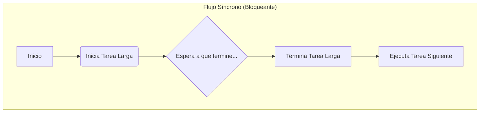
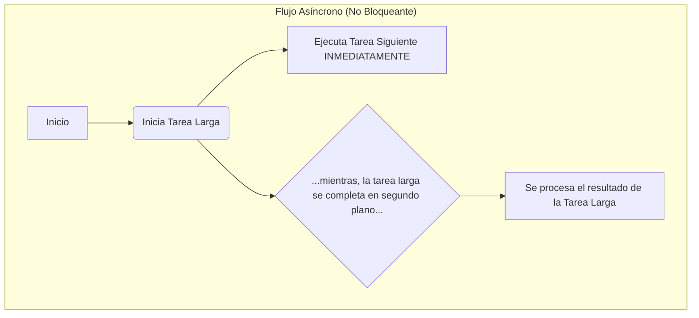

Hasta ahora, nuestras interfaces han sido como actores en un escenario vacío.  
Hemos aprendido a construir la escenografía con **HTML**, a decorarla con **CSS** y a coreografiar sus movimientos con **JavaScript**. Pero falta algo crucial: el **guion**.

Nuestras aplicaciones necesitan **datos** para ser útiles: una lista de productos, los mensajes de un chat, el perfil de un usuario... Estos datos casi nunca están dentro de la propia aplicación, sino en un servidor externo.

En este capítulo, aprenderemos a abrir las puertas de nuestra interfaz al mundo exterior para obtener datos dinámicos. Es el paso final para que nuestras creaciones dejen de ser maquetas y se conviertan en aplicaciones vivas y funcionales.

---

## ¿Qué es una API? El Camarero de Internet

Imagina que estás en un restaurante. Tú eres el **cliente** (el *frontend*, nuestra aplicación) y la cocina es el **servidor** (el *backend*, donde están los datos). No puedes entrar en la cocina a prepararte la comida; necesitas un intermediario.

Ese intermediario es el camarero: la **API (Application Programming Interface)**.

Una API es un contrato, un conjunto de reglas que define cómo tu aplicación puede pedirle cosas al servidor.

- **Tú (Frontend)**: "Camarero, tráeme la carta de postres".
- **Camarero (API)**: Va a la cocina y vuelve con la información.
- **Cocina (Backend)**: Prepara la respuesta y se la da al camarero.

En la web, este diálogo se hace principalmente a través de **APIs HTTP**, donde enviamos una petición a una URL y recibimos una respuesta, normalmente en un formato llamado **JSON**.

> Una API desacopla el frontend del backend. Tu interfaz no necesita saber cómo funciona la base de datos; solo necesita saber qué "platos" puede pedir y cómo pedirlos.

---

## REST: La Gramática de las APIs Web

**REST (Representational State Transfer)** no es una tecnología, sino un **estilo arquitectónico**, una serie de principios para diseñar APIs de forma lógica y predecible. Es como la gramática que usan la mayoría de los "camareros" de internet.

Sus ideas clave son:

1.  **Recursos**: Todo es un recurso, identificado por una URL única.
    -   `/users/123` es el usuario con ID 123.
    -   `/products` es la colección de todos los productos.

2.  **Métodos HTTP**: Usamos los "verbos" de HTTP para indicar nuestra intención sobre un recurso.
    -   **`GET`**: Leer datos (Tráeme el usuario 123).
    -   **`POST`**: Crear un nuevo recurso (Añade este nuevo usuario).
    -   **`PUT` / `PATCH`**: Actualizar un recurso (Cambia el nombre del usuario 123).
    -   **`DELETE`**: Eliminar un recurso (Borra el usuario 123).

3.  **Representaciones**: Los datos se devuelven en un formato estándar, siendo **JSON (JavaScript Object Notation)** el más común por su ligereza y facilidad de uso en JavaScript.

La API que usaremos como ejemplo, la [Rick and Morty API](https://rickandmortyapi.com/), es una API REST que nos permite consultar información sobre personajes, episodios y localizaciones de la serie.

---

## El Desafío de la Asincronía: Tareas en Paralelo

JavaScript, por naturaleza, es un lenguaje de un solo hilo (*single-threaded*). Esto significa que solo puede hacer una cosa a la vez. Si una tarea tarda mucho (como esperar la respuesta de un servidor), todo lo demás se bloquea: la interfaz se congela, los botones no responden y la experiencia de usuario se arruina.

Aquí es donde entra la **asincronía**.

La asincronía es la capacidad de iniciar una tarea de larga duración (como una petición `fetch`) y, en lugar de esperar a que termine, seguir ejecutando otras tareas. Cuando la tarea larga finaliza, nos notifica y podemos procesar su resultado.

- **Síncrono (Bloqueante)**: Como una llamada telefónica. No puedes hacer nada más hasta que cuelgues.
- **Asíncrono (No Bloqueante)**: Como enviar un WhatsApp. Envías el mensaje y sigues con tu vida. Cuando te responden, el móvil te avisa.

Visualicémoslo con un diagrama:





En el flujo síncrono, la **Tarea B** tiene que esperar a que la **Tarea Larga** termine. En el flujo asíncrono, la **Tarea B** se ejecuta inmediatamente después de iniciar la **Tarea Larga**, y el resultado de la API se procesa cuando está listo. La aplicación sigue siendo responsiva en todo momento.

`fetch()` es una función asíncrona precisamente por esto. Realizar una petición de red es una operación lenta e impredecible. Gracias a la asincronía, podemos lanzar la petición y dejar que el navegador siga funcionando sin problemas.

---

## Fetch API: Nuestra Herramienta para Hacer Peticiones

Para "hablar" con una API desde JavaScript, los navegadores nos ofrecen una herramienta moderna y potente: la **Fetch API**.

`fetch()` es una función que recibe la URL del recurso que queremos pedir. Como las peticiones a internet pueden tardar, `fetch` funciona de forma **asíncrona** y devuelve una **Promesa**: un objeto que representa un valor que estará disponible *en el futuro*.

Tenemos dos formas principales de manejar estas promesas:

### 1. `async/await` (El estilo moderno y recomendado)

Es la forma más clara y legible de trabajar con código asíncrono. La palabra `async` se pone antes de una función para indicar que contendrá operaciones asíncronas, y `await` se usa para "pausar" la ejecución hasta que una promesa se resuelva.

```javascript
async function obtenerPersonajes() {
  try {
    const respuesta = await fetch('https://rickandmortyapi.com/api/character');

    if (!respuesta.ok) {
      throw new Error(`Error HTTP: ${respuesta.status}`);
    }

    const datos = await respuesta.json(); // .json() también es una promesa
    console.log(datos.results); // ¡Aquí están nuestros personajes!

  } catch (error) {
    console.error("Falló la petición:", error);
  }
}

obtenerPersonajes();
```

:::tip[Manejo de Errores con `fetch`]
`fetch` solo rechaza una promesa si hay un error de red (ej. sin conexión). Si el servidor responde con un error (como un 404 "No encontrado" o un 500 "Error del servidor"), la promesa de `fetch` **se resuelve correctamente**.

Por eso es crucial comprobar siempre `respuesta.ok` y lanzar un error manualmente para que sea capturado por nuestro bloque `catch`.
:::

### 2. `.then() / .catch()` (El estilo clásico)

Antes de `async/await`, las promesas se encadenaban con el método `.then()`, que recibe una función a ejecutar cuando la promesa se resuelve. El método `.catch()` captura cualquier error en la cadena.

```javascript
fetch('https://rickandmortyapi.com/api/character')
  .then(respuesta => {
    if (!respuesta.ok) {
      throw new Error(`Error HTTP: ${respuesta.status}`);
    }
    return respuesta.json();
  })
  .then(datos => {
    console.log(datos.results);
  })
  .catch(error => {
    console.error("Falló la petición:", error);
  });
```

Ambos enfoques logran lo mismo, pero `async/await` suele resultar en un código más fácil de leer y depurar, ya que se parece más al código síncrono tradicional.

---

## Ejemplo Práctico: Una Galería de Personajes

Vamos a aplicar todo lo aprendido para construir una pequeña aplicación que muestra una galería de personajes de Rick and Morty.

**El Plan:**

1.  **HTML**: Un contenedor vacío donde irán las tarjetas de los personajes y un botón para cargar los datos.
2.  **JavaScript**:
    -   Una función `async` que haga la petición a la API.
    -   Cuando lleguen los datos, recorrer el array de personajes.
    -   Por cada personaje, crear dinámicamente los elementos del DOM (una tarjeta con su imagen y nombre).
    -   Añadir todas las tarjetas al contenedor en el HTML.

Aquí tienes el código completo. Puedes guardarlo en un archivo `index.html` y abrirlo en tu navegador para verlo en acción.

```html
<!DOCTYPE html>
<!DOCTYPE html>
<html lang="es">

<head>
    <meta charset="UTF-8">
    <meta name="viewport" content="width=device-width, initial-scale=1.0">
    <title>Galería de Rick and Morty</title>
    <style>
        body {
            font-family: system-ui, sans-serif;
            background: #111;
            color: #eee;
        }
        #gallery {
            display: grid;
            grid-template-columns: repeat(auto-fill, minmax(200px, 1fr));
            gap: 1rem;
            padding: 1rem;
        }
        .card {
            background: #222;
            border-radius: 8px;
            overflow: hidden;
            text-align: center;
        }
        .card img {
            width: 100%;
            display: block;
        }
        .card h3 {
            margin: 0.5rem 0;
        }
        #loader {
            text-align: center;
            padding: 2rem;
            font-size: 1.5rem;
            display: none;
        }
    </style>
</head>

<body>

    <div id="loader">Cargando...</div>
    <div id="gallery"></div>

    <script>
        const gallery = document.getElementById('gallery');
        const loadButton = document.getElementById('loadButton');
        const loader = document.getElementById('loader');

        async function fetchAndRenderCharacters() {
            // 1. Mostrar el loader y vaciar la galería
            loader.style.display = 'block';
            gallery.innerHTML = '';

            try {
                // 2. Hacer la petición a la API
                const response = await fetch('https://rickandmortyapi.com/api/character');
                if (!response.ok) {
                    throw new Error(`HTTP error! status: ${response.status}`);
                }
                const data = await response.json();

                // 3. Crear las tarjetas de los personajes
                const characterHTML = data.results.map(character => `
          <div class="card">
            
            <h3>${character.name}</h3>
          </div>
        `).join('');

                // 4. Insertar el HTML en la galería
                gallery.innerHTML = characterHTML;

            } catch (error) {
                gallery.innerHTML = `<p style="color: red;">Error al cargar los personajes: ${error.message}</p>`;
            } finally {
                // 5. Ocultar el loader
                loader.style.display = 'none';
            }
        }

        fetchAndRenderCharacters();
    </script>
</body>
</html>
```

Este ejemplo es la culminación de todo lo que hemos visto en la unidad. Usamos JavaScript de forma **imperativa** (`createElement`, `appendChild`, etc., aunque aquí abreviamo con `innerHTML`) para manipular el DOM, pero esta vez los datos no están inventados en nuestro código, sino que vienen de una fuente externa y real.

---

Hemos cerrado el círculo. Ahora nuestras interfaces no solo son interactivas, sino que también están conectadas al mundo.