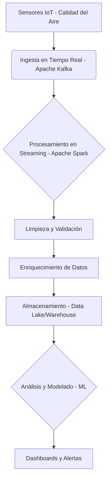

## Introducción a la Complejidad Computacional

Cuando programas no basta con que el algoritmo **funcione**. También importa **cómo de rápido** y **cuánta memoria** necesita para hacerlo.  
Esto es justo lo que estudia la **complejidad computacional**: clasificar los problemas y algoritmos según los recursos que consumen.

Imagina que quieres buscar una canción en tu móvil.  
- Si la lista está ordenada, la encuentras en segundos.  
- Si tuvieras que escuchar todas las canciones una por una hasta dar con ella, tardarías muchísimo.  

Esa diferencia refleja la importancia de la complejidad.

### Medidas de Complejidad

- **Tiempo**: número de pasos que un algoritmo necesita para completarse.  
  Ejemplo: recorrer tu lista de contactos de 20 personas tarda menos que si fueran 2.000.
- **Espacio**: memoria que utiliza mientras se ejecuta.  
  Ejemplo: una aplicación que guarda varias copias de la misma foto ocupa más memoria sin necesidad.

---

## Notación Asintótica

No solemos medir algoritmos en segundos, sino en **cómo se comportan al crecer la cantidad de datos**.  
Aquí entran las notaciones asintóticas:

- **O (Big O)** → límite superior, el **peor caso**.  
  Ejemplo: buscar un amigo en una lista desordenada puede obligarte a mirarlos todos.
- **Ω (Omega)** → límite inferior, el **mejor caso**.  
  Ejemplo: si tu amigo es el primero en la lista, acabas al instante.
- **Θ (Theta)** → comportamiento promedio (ajustado).  
  Ejemplo: normalmente necesitarías revisar “más o menos la mitad” de los nombres.

:::tip
La notación asintótica no mide segundos exactos, sino **cómo escala el algoritmo** a medida que aumentan los datos.
:::

---

## La Complejidad en Big Data: Desafíos Técnicos y No Técnicos

En el mundo del Big Data, el volumen, la velocidad y la variedad de la información son tan abrumadores que un algoritmo ineficiente deja de ser una opción. Aunque funcione en teoría, en la práctica sería inviable. Pero la complejidad va más allá de lo puramente computacional:

### Desafíos Técnicos

-   **Escalabilidad**: El sistema debe ser capaz de crecer y manejar volúmenes de datos que se multiplican por mil sin degradar su rendimiento.  
    Ejemplo: Filtrar publicaciones en una red social con millones de usuarios activos simultáneamente.
-   **Procesamiento Distribuido**: Los datos se reparten y procesan en distintos nodos de un clúster. Esto introduce retos de coordinación, comunicación y tolerancia a fallos.  
    Ejemplo: Spotify analiza tendencias musicales repartiendo el trabajo entre cientos de servidores para procesar petabytes de datos de escucha.
-   **Optimización de Algoritmos y Estructuras de Datos**: Elegir las estructuras de datos y algoritmos adecuados es crucial para la eficiencia. Un pequeño error puede significar horas o días de procesamiento extra.  
    Ejemplo: Usar un índice para buscar un registro en una base de datos es infinitamente más rápido que escanear toda la tabla.
-   **Integración de Datos**: Combinar datos de múltiples fuentes heterogéneas (bases de datos, APIs, archivos de texto, sensores) en un formato coherente y utilizable.
-   **Calidad de Datos**: Asegurar que los datos sean precisos, completos, consistentes y actuales. Los datos sucios o incompletos pueden llevar a análisis erróneos.

### Desafíos No Técnicos

-   **Seguridad y Privacidad**: Proteger la información sensible de accesos no autorizados y cumplir con regulaciones estrictas como el RGPD.  
    Ejemplo: Un hospital que maneja historiales médicos de miles de pacientes debe garantizar la máxima seguridad.
-   **Gobernanza de Datos**: Establecer políticas y procedimientos para la gestión, uso y protección de los datos a lo largo de su ciclo de vida.
-   **Sesgos en los Datos**: Los algoritmos aprenden de los datos. Si los datos históricos contienen sesgos (por ejemplo, en decisiones de contratación o préstamos), el algoritmo los replicará y amplificará, llevando a resultados injustos o discriminatorios.
-   **Costo**: La infraestructura, el almacenamiento y el procesamiento de Big Data pueden ser muy costosos, requiriendo una inversión significativa.
-   **Talento**: La escasez de profesionales con las habilidades necesarias para diseñar, implementar y mantener sistemas Big Data.

:::note
En Big Data, no solo se trata de que el algoritmo funcione, sino de que pueda hacerlo de manera eficiente, segura y ética con miles de millones de datos, y que el resultado sea fiable y valioso.
:::

---

## Un Pipeline de Datos Complejo: Del Sensor al Análisis

Para entender la complejidad en la práctica, imaginemos un sistema de monitorización de la calidad del aire en una ciudad. Un flujo de datos típico podría ser:

1.  **Sensores IoT**: Miles de sensores distribuidos por la ciudad recogen datos de partículas, gases, temperatura, humedad, etc., cada pocos segundos.
2.  **Ingesta de Datos**: Estos datos se envían a una plataforma de ingesta en tiempo real (como Apache Kafka), que debe manejar un flujo constante y masivo de información.

  

3.  **Procesamiento en Streaming**: Un motor de procesamiento (como Apache Spark Streaming) consume estos datos, los limpia, los valida y los enriquece (por ejemplo, añadiendo la ubicación geográfica exacta o el tipo de sensor).
4.  **Almacenamiento**: Los datos procesados se almacenan en un Data Lake (para datos crudos y semi-procesados) y en un Data Warehouse (para datos agregados y listos para análisis).
5.  **Análisis y Modelado**: Se ejecutan modelos predictivos para prever picos de contaminación o se realizan análisis para identificar patrones geográficos y temporales.
6.  **Visualización y Alertas**: Los resultados se muestran en dashboards interactivos para las autoridades y se generan alertas automáticas si los niveles de contaminación superan ciertos umbrales.

Cada etapa de este pipeline introduce sus propios desafíos de escalabilidad, latencia, consistencia y gestión de errores. Un fallo en un punto puede propagarse y afectar la fiabilidad de todo el sistema.

---

## Ejemplos de Clases de Complejidad

-   **P (Polinomial)**: Problemas que se resuelven en tiempo "razonable", donde el tiempo de ejecución crece polinomialmente con el tamaño de la entrada.  
    Ejemplo: Ordenar tu carpeta de fotos con un algoritmo eficiente (como Quicksort o Mergesort).
-   **NP (No determinista Polinomial)**: Problemas para los que no conocemos un algoritmo eficiente que encuentre la solución, pero sí podemos verificar una solución propuesta en tiempo polinomial.  
    Ejemplo: Organizar el horario de todas las clases de un instituto sin solapamientos, optimizando el uso de aulas y profesores.

:::tip
Muchos problemas reales en Big Data, como la optimización de rutas logísticas, la planificación de recursos o la asignación de tareas, son **NP-completos**: sabemos verificar una solución, pero encontrar la mejor de forma eficiente es un desafío computacional enorme. Esto nos obliga a buscar soluciones aproximadas o heurísticas.
:::

Ahora que hemos comprendido los desafíos inherentes al manejo de grandes volúmenes de datos, es momento de explorar las **arquitecturas y herramientas** que nos permiten superar estas complejidades.

---

## Preguntas para la Reflexión

1.  ¿Por qué un algoritmo con complejidad O(n^2) puede ser aceptable para una pequeña lista de contactos en tu móvil, pero completamente inviable para analizar las conexiones de usuarios en una red social como Facebook?
2.  En el pipeline de datos de calidad del aire, ¿qué podría pasar si la etapa de "Limpieza y Validación" falla o se realiza de forma incorrecta? ¿Qué impacto tendría en las decisiones de las autoridades?
3.  Además de los sesgos en los datos, ¿qué otros problemas éticos crees que pueden surgir en un proyecto de Big Data que analiza el comportamiento de los ciudadanos?
