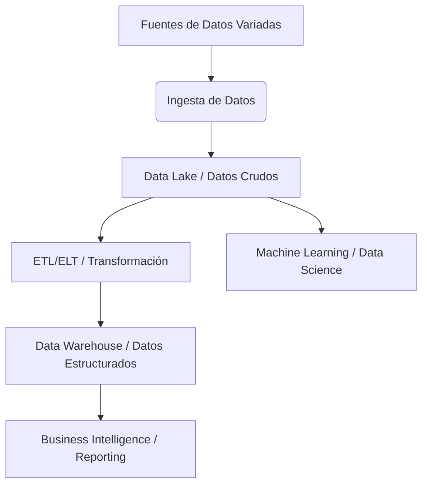
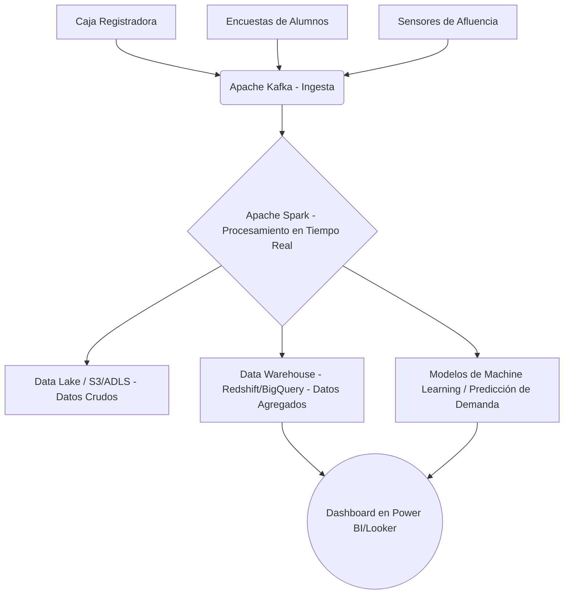

import { Card, CardGrid } from '@astrojs/starlight/components';

## Arquitecturas Big Data: Diseñando para la Escala

Las arquitecturas Big Data están diseñadas para **almacenar, procesar y analizar grandes volúmenes de datos** de forma distribuida. Imagina que en lugar de que un solo ordenador haga todo el trabajo, se reparten las tareas entre muchos, como si en clase os encargaran ordenar todos los libros de la biblioteca del instituto y lo hicierais en equipo en lugar de uno solo. Esta aproximación distribuida es clave para manejar la complejidad que vimos en el capítulo anterior.

---

### Apache Hadoop: El Pionero del Procesamiento Batch

Hadoop es un framework de código abierto que sentó las bases del Big Data. Su filosofía es simple: llevar el procesamiento a los datos, no los datos al procesamiento. Sus componentes principales son:
<div className="flex justify-center my-8">
  
</div>
<div className="flex justify-center my-8">
  
</div>

-   **HDFS (Hadoop Distributed File System)**: Un sistema de archivos que divide los datos en bloques y los reparte entre miles de máquinas. Está optimizado para el almacenamiento de grandes archivos y el acceso secuencial.
-   **MapReduce**: Un modelo de programación para procesar esos datos en paralelo. Es ideal para tareas de procesamiento por lotes (batch), donde se procesan grandes volúmenes de datos de una vez, sin requisitos de inmediatez.
-   **YARN (Yet Another Resource Negotiator)**: El gestor de recursos que coordina el trabajo en el clúster, asignando recursos a las aplicaciones que se ejecutan sobre Hadoop.

:::note
Hadoop fue fundamental para democratizar el procesamiento de Big Data, pero su modelo de escritura y lectura intensiva en disco (MapReduce) lo hace menos eficiente para tareas que requieren baja latencia o procesamiento interactivo. Es excelente para análisis históricos y reportes que no necesitan resultados inmediatos.
:::

---

### Apache Spark: Velocidad y Versatilidad en Tiempo Real

Spark es un motor de procesamiento unificado, también open source, que surgió como una evolución de MapReduce, siendo mucho más **rápido y versátil**. Su principal ventaja es que procesa los datos en memoria, lo que reduce drásticamente los tiempos de ejecución.

-   **Velocidad**: Al trabajar en memoria, evita el cuello de botella del disco duro, siendo hasta 100 veces más rápido que MapReduce para ciertas cargas de trabajo.
-   **Versatilidad**: Soporta una amplia gama de cargas de trabajo: procesamiento por lotes (batch), streaming (datos en tiempo real), consultas SQL interactivas, machine learning (MLlib) y análisis de grafos (GraphX), todo en una sola plataforma.
-   **APIs amigables**: Ofrece interfaces de programación en lenguajes populares como Python, Java, Scala y R, facilitando su adopción por parte de desarrolladores y científicos de datos.

:::tip
Cuando una empresa necesita analizar “en directo” lo que hacen sus usuarios (como Twitter para tendencias o Netflix para recomendaciones instantáneas), o procesar datos de sensores en tiempo real, Apache Spark es la herramienta preferida. Permite reaccionar a los eventos a medida que ocurren.
:::

---

## Arquitecturas Modernas de Big Data

El panorama de Big Data ha evolucionado, dando lugar a arquitecturas más sofisticadas que combinan diferentes herramientas para optimizar el flujo de datos.

### Data Lakes vs. Data Warehouses

Son dos conceptos clave para el almacenamiento de datos a gran escala:

-   **Data Lake (Lago de Datos)**: Un repositorio centralizado que almacena una cantidad masiva de datos brutos en su formato nativo (estructurados, semiestructurados y no estructurados). Es como un gran lago donde se vierte todo sin procesar, listo para ser explorado cuando sea necesario. Ideal para científicos de datos que necesitan datos crudos para experimentos.
-   **Data Warehouse (Almacén de Datos)**: Un repositorio de datos estructurados y preprocesados, optimizado para consultas y reportes analíticos. Los datos se limpian, transforman y cargan siguiendo un esquema definido. Es como una biblioteca bien organizada, donde cada libro está en su sitio.


### Arquitecturas Lambda y Kappa

Estas arquitecturas buscan combinar el procesamiento por lotes (batch) con el procesamiento en tiempo real (streaming) para ofrecer una visión completa y actualizada de los datos.

-   **Arquitectura Lambda**: Divide el procesamiento en dos capas: una capa batch (para datos históricos y precisos) y una capa speed (para datos en tiempo real y con menor precisión). Los resultados de ambas capas se combinan en una capa de servicio. Es robusta pero compleja de mantener.

    ```mermaid
    graph TD
        A[Datos Entrantes] --> B{Capa Batch / Hadoop};
        A --> C{Capa Speed / Spark Streaming};
        B --> D[Vista Batch];
        C --> E[Vista en Tiempo Real];
        D & E --> F[Capa de Servicio / Consultas];
    ```

-   **Arquitectura Kappa**: Simplifica la Lambda eliminando la capa batch y procesando todos los datos como un flujo continuo. Los datos históricos se reprocesan a través del mismo motor de streaming. Es más sencilla de implementar y mantener, pero requiere un motor de streaming muy potente.

    ```mermaid
    graph TD
        A[Datos Entrantes] --> B{Capa Streaming / Spark/Flink};
        B --> C[Almacenamiento de Datos / Histórico];
        B --> D[Vista en Tiempo Real];
        C --> B;
        D --> E[Capa de Servicio / Consultas];
    ```

### Big Data en la Nube: Flexibilidad y Escalabilidad
<div className="flex justify-center my-8">
  
</div>
Los proveedores de servicios en la nube (AWS, Azure, Google Cloud Platform) ofrecen plataformas completas de Big Data como servicios gestionados. Esto permite a las empresas escalar su infraestructura de forma elástica, pagar solo por lo que usan y centrarse en el análisis en lugar de la gestión de la infraestructura.

-   **AWS (Amazon Web Services)**: EMR (Hadoop/Spark), S3 (almacenamiento), Redshift (Data Warehouse), Kinesis (streaming).
-   **Azure (Microsoft Azure)**: Azure HDInsight (Hadoop/Spark), Azure Data Lake Storage, Azure Synapse Analytics (Data Warehouse), Azure Stream Analytics.
-   **GCP (Google Cloud Platform)**: Dataproc (Hadoop/Spark), Cloud Storage, BigQuery (Data Warehouse), Dataflow (streaming).

---

## Arquitectura para la Cafetería del IES Ágora: Un Ejemplo Práctico

Volviendo a nuestro caso práctico, ¿cómo montaríamos un sistema para analizar los datos de la cafetería? Podríamos diseñar una arquitectura simple usando Spark como cerebro de la operación, pero ahora con una visión más completa:



1.  **Ingesta de Datos (Apache Kafka)**: Un sistema como Kafka recogería en tiempo real cada venta de la caja registradora, los resultados de las encuestas de satisfacción y los datos de sensores de afluencia.
2.  **Procesamiento (Apache Spark)**: Spark recibiría esos datos, los limpiaría, transformaría y enriquecería. Podría calcular las ventas por producto, las horas punta o analizar el sentimiento de las opiniones de los alumnos.
3.  **Almacenamiento (Data Lake / Data Warehouse)**: Los datos crudos irían a un Data Lake para futuras exploraciones, mientras que los datos procesados y agregados se almacenarían en un Data Warehouse, optimizado para consultas analíticas.
4.  **Análisis y Machine Learning**: Sobre el Data Warehouse se ejecutarían modelos de Machine Learning para predecir la demanda de productos o la formación de colas.
5.  **Visualización (Power BI / Looker)**: Los resultados del análisis y las predicciones se mostrarían en paneles de control interactivos para el personal de la cafetería, permitiéndoles tomar decisiones informadas.

---

## Ecosistema Big Data: Un Mundo de Herramientas

El ecosistema Big Data es vasto y está en constante evolución. Es un conjunto de herramientas que trabajan juntas para cubrir todas las fases del ciclo de vida del dato. Algunas de las más importantes son:

<CardGrid>
  <Card title="Almacenamiento" icon="hard-drive">
    HDFS, Amazon S3, Azure Data Lake Storage, Google Cloud Storage, Bases de Datos NoSQL (MongoDB, Cassandra, HBase).
    <div className="flex justify-center my-4 gap-4">
      
      
    </div>
  </Card>
  <Card title="Ingesta de Datos" icon="download">
    Apache Kafka, Apache Flume, AWS Kinesis, Azure Event Hubs, Google Cloud Pub/Sub.
    <div className="flex justify-center my-4">
      
    </div>
  </Card>
  <Card title="Procesamiento de Datos" icon="cpu">
    Apache Spark, Apache Flink, Apache Storm, Google Cloud Dataflow.
    <div className="flex justify-center my-4">
      
    </div>
  </Card>
  <Card title="Orquestación" icon="git-pull-request">
    Apache Airflow, AWS Step Functions, Azure Data Factory.
  </Card>
  <Card title="Machine Learning" icon="brain">
    MLlib (Spark), TensorFlow, PyTorch, scikit-learn.
  </Card>
  <Card title="Visualización" icon="bar-chart-2">
    Tableau, Power BI, Apache Superset, Looker, Grafana.
  </Card>
</CardGrid>

:::tip
Lo importante no es aprender todas las herramientas, sino **entender el papel que juega cada una** en el pipeline de Big Data: ingesta, almacenamiento, procesamiento, análisis y visualización. La elección de la herramienta dependerá de los requisitos específicos del proyecto.
:::

Ahora que hemos explorado las diferentes arquitecturas y herramientas que nos permiten manejar la complejidad del Big Data, es fundamental entender cómo organizar y guiar estos proyectos. En el siguiente capítulo, nos adentraremos en los **modelos y metodologías** que nos ayudarán a abordar un proyecto Big Data de forma estructurada y exitosa.

---

## Preguntas para la Reflexión

1.  ¿Por qué crees que Apache Spark se ha vuelto tan popular y ha reemplazado en muchos casos a MapReduce de Hadoop? ¿Qué ventaja clave ofrece?
2.  Imagina que una empresa como Zara quiere analizar las ventas de todas sus tiendas en el mundo para optimizar su stock. ¿Qué arquitectura (Lambda o Kappa) crees que sería más adecuada y por qué?
3.  ¿Qué ventajas ofrece a una startup utilizar servicios de Big Data en la nube (como AWS, Azure o GCP) en lugar de montar su propia infraestructura física?
