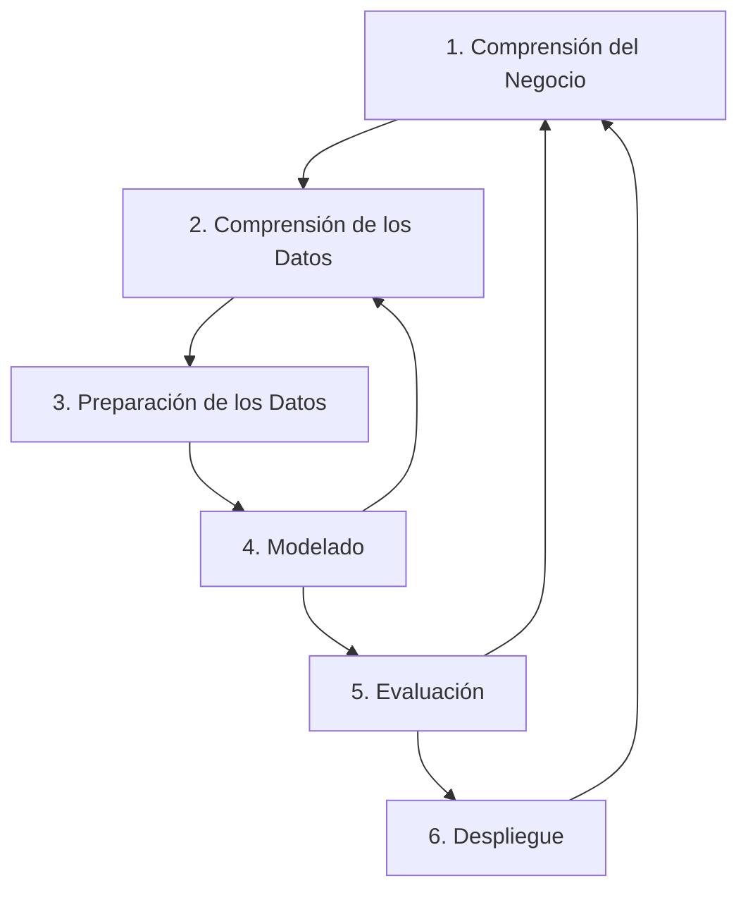

## ¿Por qué necesitamos una metodología en Big Data?

En proyectos de Big Data, no basta con tener datos y algoritmos potentes. Necesitamos una **metodología clara** que nos guíe paso a paso, desde entender qué problema queremos resolver hasta poner la solución en marcha y asegurar su valor. Es como organizar un viaje complejo: primero decides el destino y el propósito, luego planificas la ruta, el transporte y las actividades, y finalmente evalúas si el viaje fue exitoso. Sin un plan estructurado, es fácil perderse en la inmensidad de los datos.

---

### CRISP-DM (Cross-Industry Standard Process for Data Mining): El Estándar de la Industria

CRISP-DM es la metodología más utilizada en proyectos de Data Science y Big Data. Es **cíclica e iterativa**, lo que significa que puedes (y debes) volver a fases anteriores si descubres algo nuevo o si los resultados no son los esperados. Esto permite una mejora continua y una adaptación a los cambios.

#### CRISP-DM en la Cafetería del IES Ágora: Un Caso Cercano

Vamos a aplicar estas fases a nuestro caso práctico de la cafetería:

1.  **Comprensión del Negocio**: El objetivo es **reducir las colas y optimizar el stock** de la cafetería. Queremos que los alumnos esperen menos y que siempre encuentren sus bocadillos favoritos, minimizando las pérdidas por productos no vendidos.

2.  **Comprensión de los Datos**: Recopilamos los tickets de venta del último año, datos de afluencia (sensores), encuestas de satisfacción y el calendario escolar. Al explorarlos, vemos que los datos de venta están en formato texto y que a veces el nombre del producto está mal escrito ("Boc. tortilla" vs "Bocadillo de tortilla"). También notamos picos de venta durante los recreos.

3.  **Preparación de los Datos**: Unificamos los nombres de los productos, eliminamos ventas nulas, transformamos las fechas a un formato estándar y creamos nuevas columnas como "hora del día", "día de la semana" o "es día de examen". Integramos los datos de afluencia y encuestas.

4.  **Modelado**: Aplicamos un algoritmo de series temporales (ej. ARIMA o Prophet) para predecir las ventas del día siguiente y la afluencia por franjas horarias. También usamos un modelo de asociación (ej. Apriori) para descubrir que los alumnos que compran un refresco de cola suelen comprar también un bocadillo de lomo.

5.  **Evaluación**: Comprobamos si el modelo de predicción de ventas tiene un error aceptable (ej. un margen de error del 10% en la predicción de la demanda total). Evaluamos si la regla de asociación "refresco de cola -> bocadillo de lomo" es estadísticamente significativa y si su aplicación generaría un aumento de ventas.

6.  **Despliegue**: Si los modelos son robustos, se implementan. Se podría crear un panel para el personal de la cafetería que muestre la predicción de ventas para el día siguiente, sugiera combos de productos y alerte sobre posibles colas en tiempo real. Esto permitiría ajustar la producción y el personal.

---

### Un Ejemplo Aplicado de CRISP-DM: Detección de Enfermedades Cardíacas

Para ver la versatilidad de CRISP-DM, consideremos un proyecto en el sector salud:

1.  **Comprensión del Negocio**: Desarrollar un modelo predictivo para identificar pacientes con alto riesgo de desarrollar enfermedades cardíacas en los próximos 5 años, con el fin de implementar programas de prevención temprana.
2.  **Comprensión de los Datos**: Recopilar historiales médicos (edad, sexo, presión arterial, colesterol, historial familiar, hábitos de vida), resultados de pruebas de laboratorio y datos de dispositivos wearables. Analizar la calidad y completitud de estos datos.
3.  **Preparación de los Datos**: Limpiar datos faltantes, normalizar valores, crear nuevas características (ej. índice de masa corporal a partir de peso y altura), y balancear el conjunto de datos si hay muchos más pacientes sanos que enfermos.
4.  **Modelado**: Entrenar varios modelos de Machine Learning (ej. Regresión Logística, Random Forest, Redes Neuronales) utilizando los datos preparados.
5.  **Evaluación**: Comparar el rendimiento de los modelos utilizando métricas como precisión, recall, F1-score y el área bajo la curva ROC. Seleccionar el modelo que mejor equilibre la detección de enfermos (recall) con la minimización de falsos positivos (precisión).
6.  **Despliegue**: Integrar el modelo seleccionado en el sistema de gestión hospitalaria para que los médicos puedan consultar el riesgo de cada paciente. Se podría desarrollar una interfaz que muestre el riesgo y sugiera intervenciones preventivas personalizadas.

---

### SEMMA (Sample, Explore, Modify, Model, Assess): Enfocado en el Modelado

SEMMA fue creada por **SAS Institute** y está más centrada en la parte técnica del modelado y la minería de datos. Es menos un ciclo de proyecto completo y más una secuencia lógica de pasos para la construcción de modelos predictivos:

1.  **Sample (Muestreo)**: Seleccionar un subconjunto representativo de los datos si el volumen total es demasiado grande para procesar eficientemente, o para crear conjuntos de entrenamiento y prueba.
2.  **Explore (Exploración)**: Visualizar y analizar los datos para encontrar patrones, anomalías, relaciones entre variables y entender su distribución. Esto incluye estadísticas descriptivas y gráficos.
3.  **Modify (Modificación)**: Limpiar, transformar y crear nuevas variables (ingeniería de características) a partir de los datos existentes para mejorar el rendimiento del modelo. Por ejemplo, convertir variables categóricas en numéricas.
4.  **Model (Modelado)**: Aplicar algoritmos predictivos o descriptivos para construir el modelo. Aquí es donde se entrena el algoritmo con los datos preparados.
5.  **Assess (Evaluación)**: Medir la fiabilidad, precisión y utilidad del modelo utilizando métricas estadísticas y de negocio. Se valida el modelo con datos no vistos previamente.

:::note
SEMMA es muy útil cuando el objetivo de negocio ya está muy claro y el foco principal está en la construcción y optimización del modelo. Se puede considerar como una profundización de las fases de Comprensión de Datos, Preparación de Datos, Modelado y Evaluación de CRISP-DM.
:::

---

### Otras Metodologías Relevantes

El campo del Big Data y la Ciencia de Datos es dinámico, y han surgido otras metodologías o adaptaciones:

-   **KDD (Knowledge Discovery in Databases)**: Una metodología más antigua que CRISP-DM, pero que sentó muchas de sus bases. Se centra en el proceso de descubrir patrones útiles en grandes conjuntos de datos. Sus fases son: Selección, Preprocesamiento, Transformación, Minería de Datos e Interpretación/Evaluación.
-   **Agile Data Science**: Adapta los principios de las metodologías ágiles (como Scrum o Kanban) a los proyectos de ciencia de datos. Se enfoca en la entrega incremental de valor, la colaboración constante con el cliente y la capacidad de respuesta al cambio. Es ideal para proyectos donde los requisitos evolucionan rápidamente.

---

## Buenas Prácticas en Proyectos Big Data

Independientemente de la metodología elegida, hay principios clave que aseguran el éxito de un proyecto Big Data:

-   **Iteración Constante**: Los proyectos de datos rara vez son lineales. Es fundamental iterar sobre las fases (especialmente comprensión de datos, preparación y modelado) para refinar el enfoque y mejorar los resultados.
-   **Validación Rigurosa**: Validar los modelos y los resultados no solo con métricas técnicas, sino también con el conocimiento del dominio y los objetivos de negocio. Un modelo puede ser estadísticamente bueno pero inútil en la práctica.
-   **Visualización de Resultados**: Presentar los hallazgos de manera clara y comprensible para todos los stakeholders, no solo para los técnicos. Los dashboards interactivos y los informes visuales son cruciales para la toma de decisiones.
-   **Colaboración Interdisciplinar**: Los proyectos Big Data requieren la colaboración de expertos en negocio, científicos de datos, ingenieros de datos y desarrolladores.
-   **Documentación**: Mantener un registro claro de los datos, los procesos, los modelos y las decisiones tomadas.

---

## Comparación y Aplicación: Eligiendo la Metodología Adecuada

-   **CRISP-DM**: Es una metodología de gestión de proyectos integral. Su foco es amplio, desde el problema de negocio hasta la solución final y su despliegue.
-   **SEMMA**: Es una metodología de minería de datos, más técnica y centrada en el proceso de construcción y evaluación de modelos.
-   **KDD**: Un marco conceptual para el descubrimiento de conocimiento, con un enfoque más académico.
-   **Agile Data Science**: Una filosofía de trabajo que prioriza la flexibilidad y la entrega de valor incremental.

---

## Comparación Visual de Metodologías

Para que puedas ver las diferencias de un solo vistazo, aquí tienes una tabla comparativa:

| Característica | CRISP-DM | SEMMA | KDD | Agile Data Science |
| :--- | :--- | :--- | :--- | :--- |
| **Enfoque Principal** | Gestión del ciclo de vida completo del proyecto. | Proceso técnico de modelado de datos. | Descubrimiento de conocimiento en bases de datos. | Entrega de valor incremental y flexibilidad. |
| **Fases Clave** | 6 fases (Negocio, Datos, Preparación, Modelado, Evaluación, Despliegue). | 5 fases (Muestreo, Exploración, Modificación, Modelado, Evaluación). | 5 fases (Selección, Preproceso, Transformación, Minería, Evaluación). | Sprints, iteraciones, feedback continuo. |
| **Fortaleza** | Completa, orientada al negocio y estándar de la industria. | Fuerte enfoque en los pasos técnicos del modelado. | Sólida base teórica para la minería de datos. | Adaptabilidad, rapidez y colaboración con el cliente. |
| **Debilidad** | Puede ser demasiado rígida o lenta para proyectos muy dinámicos. | No cubre la comprensión del negocio ni el despliegue. | Menos orientado a la gestión de proyectos y al negocio. | Requiere una alta disciplina de equipo y un cliente implicado. |
| **Ideal para...** | Proyectos de Data Science bien definidos y de gran escala. | Equipos de modelado que necesitan una guía técnica clara. | Investigación y exploración de patrones en datos. | Startups y proyectos con requisitos cambiantes. |

:::

Con una comprensión sólida de las metodologías, estamos listos para ver cómo el Big Data se aplica en el mundo real y cuáles son las tendencias que están marcando el futuro. En el próximo capítulo, exploraremos las **aplicaciones y tendencias actuales** del Big Data.

---

## Preguntas para la Reflexión

1.  ¿Qué metodología crees que sería más adecuada para un proyecto que busca analizar el sentimiento de los comentarios en las redes sociales de una marca? ¿Por qué?
2.  Imagina que estás en un equipo que utiliza una metodología ágil. ¿Qué ventajas y desventajas crees que tendría este enfoque en el proyecto de la cafetería del IES Ágora?
3.  ¿Por qué es tan importante la fase de "Comprensión del Negocio" en CRISP-DM? ¿Qué podría pasar si un equipo de Data Science se salta esta fase?
