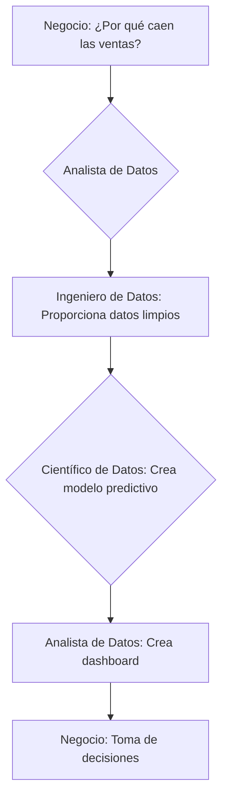

import { Card, CardGrid } from '@astrojs/starlight/components';

## ¿Quién es Quién en el Mundo del Big Data?

Un proyecto de Big Data es un esfuerzo de equipo que requiere una combinación de habilidades diversas. No existe un único "experto en Big Data", sino un conjunto de roles que colaboran para transformar los datos en valor. Conocer estos perfiles te ayudará a entender mejor el ecosistema y a orientar tu propia carrera profesional.

A continuación, exploramos los tres roles más demandados en el campo del Big Data.

  <Card title="Ingeniero de Datos (Data Engineer)">
    **Misión:** Construir y mantener las autopistas de datos.  

    **Claves:**  
    - Pipelines ETL/ELT  
    - Bases de datos SQL/NoSQL  
    - Spark, Hadoop, Kafka  
    - Cloud (AWS, Azure, GCP)
  </Card>

  <Card title="Científico de Datos (Data Scientist)">
    **Misión:** Extraer conocimiento y predicciones.  

    **Claves:**  
    - Análisis exploratorio  
    - Machine Learning & Deep Learning  
    - Python, R  
    - Visualización (Tableau, Power BI)
  </Card>

  <Card title="Analista de Datos (Data Analyst)">
    **Misión:** Convertir datos en información útil para el negocio.  

    **Claves:**  
    - Dashboards & KPIs  
    - SQL avanzado  
    - Herramientas BI (Tableau, Power BI)  
    - Comunicación clara
  </Card>

---

## La Colaboración es la Clave

Estos roles no trabajan en silos. Un flujo de trabajo típico podría ser:

1.  El **Analista de Datos** identifica una pregunta de negocio, como "¿Por qué han bajado las ventas este mes?".
2.  El **Ingeniero de Datos** se asegura de que los datos de ventas, marketing y de la web estén disponibles, limpios y accesibles en el Data Warehouse.
3.  El **Científico de Datos** utiliza esos datos para construir un modelo que no solo explique la caída, sino que también prediga las ventas futuras e identifique los factores clave que las impulsan.
4.  El **Analista de Datos** toma los hallazgos del científico de datos y los presenta en un dashboard interactivo para que el equipo de dirección pueda tomar decisiones informadas.

---

## ¿Qué Camino Elegir?

Como estudiante de Desarrollo de Aplicaciones Multiplataforma, tienes una base excelente para cualquiera de estos roles, especialmente para el de **Ingeniero de Datos**, que requiere fuertes habilidades de programación y arquitectura de software.

-   Si te apasiona **construir sistemas robustos, optimizar el rendimiento y trabajar con la infraestructura** que hace todo posible, la **Ingeniería de Datos** es tu camino.
-   Si te atrae la **estadística, el descubrimiento de patrones ocultos y la creación de modelos predictivos**, la **Ciencia de Datos** podría ser tu vocación.
-   Si disfrutas **contando historias con datos, creando visualizaciones impactantes y ayudando a otros a entender la información**, el **Análisis de Datos** es una excelente opción.

:::tip
No te preocupes por elegir un camino definitivo ahora. A medida que avances en tus estudios y proyectos, descubrirás qué áreas te gustan más. Lo importante es construir una base sólida en programación, bases de datos y tener una curiosidad insaciable por los datos.
:::