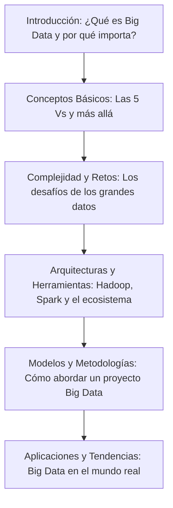

¡Hola, futuro experto en datos!

En la era digital actual, los datos son el nuevo oro. Desde las recomendaciones personalizadas de Netflix hasta la detección de fraudes en tu banco, el **Big Data** está en todas partes, transformando la forma en que vivimos, trabajamos y tomamos decisiones. Pero, ¿qué es exactamente el Big Data y cómo podemos dominarlo?

En esta primera Unidad de Trabajo, nos adentraremos en el fascinante mundo de los grandes volúmenes de datos. No solo aprenderás qué es el Big Data y por qué es tan crucial hoy en día, sino que también descubrirás las herramientas, arquitecturas y metodologías que te permitirán transformar montañas de información en conocimiento valioso.

Esta unidad está diseñada para estudiantes de Formación Profesional que buscan comprender los fundamentos de los sistemas Big Data y prepararse para los desafíos del análisis de datos a gran escala. ¡Prepárate para desvelar los secretos que se esconden detrás de los números!

## Mapa de la Unidad: Tu Ruta de Aprendizaje

Aquí tienes un esquema visual de lo que exploraremos en esta unidad. Cada paso te acercará más a convertirte en un ninja del Big Data.

## Contenidos de la Unidad

Aquí tienes un desglose de los temas que cubriremos, diseñados para llevarte de la mano desde los conceptos más básicos hasta las aplicaciones más avanzadas:

- **Introducción y Casos Reales**: Una visión panorámica de qué es Big Data, por qué surge y ejemplos de su impacto en tu día a día.
- **Conceptos Básicos**: Definición, las famosas "Vs" del Big Data (Volumen, Velocidad, Variedad, Veracidad, Valor) y cómo se diferencia de las bases de datos tradicionales.
- **Complejidad y Retos**: Entender los desafíos técnicos y no técnicos que presenta el procesamiento de grandes volúmenes de datos, incluyendo escalabilidad, seguridad y privacidad.
- **Arquitecturas Big Data**: Exploración de frameworks clave como Hadoop y Spark, así como otras herramientas del ecosistema (NoSQL, Data Lakes, etc.).
- **Modelos y Metodologías**: Aplicación de enfoques estructurados como CRISP-DM y SEMMA para planificar y ejecutar proyectos de Big Data de manera efectiva.
- **Aplicaciones y Tendencias Actuales**: Descubre cómo el Big Data se combina con la Inteligencia Artificial, el procesamiento en tiempo real y las implicaciones éticas.

## Práctica de la Unidad

- **Actividades**: Ejercicios prácticos para aplicar los conocimientos adquiridos y consolidar tu aprendizaje.
- **Tareas**: Desarrollo de un proyecto práctico de análisis de datos, donde pondrás a prueba tus habilidades.

## Recursos Adicionales

- **Glosario**: Definiciones claras de los términos clave que encontrarás en el mundo del Big Data.
