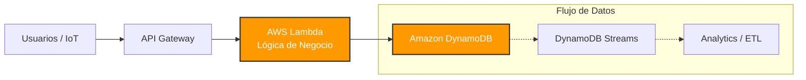
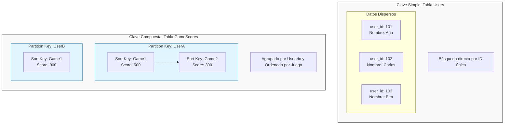
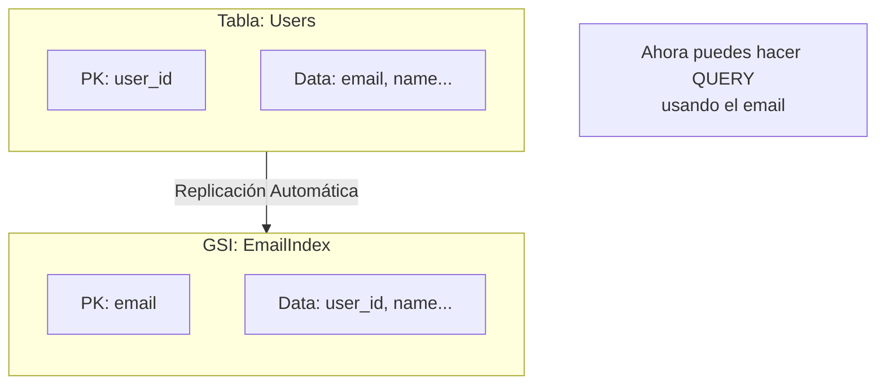

import { Card, CardGrid } from '@astrojs/starlight/components';

Amazon DynamoDB es la joya de la corona de las bases de datos NoSQL en AWS. Es una base de datos de tipo clave-valor y documental, **totalmente administrada** y **serverless**. ¿Qué significa esto? Que no tienes que preocuparte por servidores, parches o escalado. DynamoDB promete un rendimiento de milisegundos de un solo dígito a cualquier escala, ya tengas 10 usuarios o 10 millones.

En esta guía, vamos a diseccionar sus componentes y a aprender a manejarla usando la **AWS Command Line Interface (CLI)**.

---

## Componentes Centrales de DynamoDB

Antes de escribir comandos, necesitamos entender las piezas del rompecabezas:

<CardGrid>
  <Card title="Tablas" icon="list-format">
    Son el contenedor principal. A diferencia de SQL, aquí no hay esquemas fijos para toda la tabla, salvo por la **clave primaria**, que es sagrada.
  </Card>
  <Card title="Ítems" icon="document">
    Equivalente a una fila en SQL. Es un grupo de atributos identificados de forma única. DynamoDB no tiene límite en el número de ítems.
  </Card>
  <Card title="Atributos" icon="puzzle">
    Los datos individuales (columnas). Pueden ser simples (cadenas, números) o complejos (listas, mapas). Debes indicar su tipo: `S` (String), `N` (Number), etc.
  </Card>
</CardGrid>

---

## Arquitectura: ¿Dónde encaja DynamoDB?

DynamoDB rara vez trabaja sola. En una arquitectura moderna de Big Data o Serverless, suele ser el destino final de datos procesados por otras herramientas.



---

## 1. Diseño y Gestión de Tablas: El Arte de la Clave Primaria

En DynamoDB, el diseño de la tabla gira casi exclusivamente en torno a su **Clave Primaria**. Elegirla mal es garantía de problemas de rendimiento futuros.

### Tipos de Claves Primarias

Existen dos sabores de claves primarias:

1.  **Clave Primaria Simple (Solo Partition Key):**
    *   Usa un solo atributo como identificador único.
    *   Ideal para accesos directos tipo "búscame el usuario X".
    *   *Ejemplo:* `user_id`.

2.  **Clave Primaria Compuesta (Partition Key + Sort Key):**
    *   Usa dos atributos: uno para particionar (agrupar) y otro para ordenar.
    *   Permite consultas complejas: "dame todos los pedidos (Sort) de este cliente (Partition)".
    *   *Ejemplo:* `customer_id` (Partition) + `order_date` (Sort).

### Visualización: Simple vs. Compuesta

Este diagrama te ayudará a visualizar cómo se guardan físicamente los datos. Observa cómo la clave compuesta agrupa datos relacionados.



### Manos a la obra con AWS CLI

Vamos a crear dos tablas para probar estos conceptos.

#### Tabla 1: `Users` (Clave Simple)
```bash
aws dynamodb create-table \
    --table-name Users \
    --attribute-definitions \
        AttributeName=user_id,AttributeType=S \
    --key-schema \
        AttributeName=user_id,KeyType=HASH \
    --billing-mode PAY_PER_REQUEST
```
*   `KeyType=HASH` define la **Partition Key**.

#### Tabla 2: `Orders` (Clave Compuesta)
```bash
aws dynamodb create-table \
    --table-name Orders \
    --attribute-definitions \
        AttributeName=customer_id,AttributeType=S \
        AttributeName=order_date,AttributeType=S \
    --key-schema \
        AttributeName=customer_id,KeyType=HASH \
        AttributeName=order_date,KeyType=RANGE \
    --billing-mode PAY_PER_REQUEST
```
*   `KeyType=RANGE` define la **Sort Key**.

---

## 2. Operaciones CRUD: Manipulando Datos

Ahora que tenemos tablas, vamos a llenarlas.

### `put-item`: Insertar Datos
Crea un nuevo ítem o reemplaza completamente uno existente.

```bash
aws dynamodb put-item \
    --table-name Users \
    --item '{ 
        "user_id": {"S": "user123"},
        "name": {"S": "Ana"},
        "email": {"S": "ana@example.com"},
        "age": {"N": "30"}
      }'
```

:::note Sintaxis JSON de DynamoDB
Fíjate que cada valor tiene su tipo explícito: `{"S": "valor"}` para Strings, `{"N": "123"}` para Números. Es verboso, pero necesario para la CLI.
:::

### `get-item`: Leer un Dato
La forma más rápida de leer. Necesitas la clave primaria exacta.

```bash
aws dynamodb get-item \
    --table-name Users \
    --key '{"user_id": {"S": "user123"}}'
```

#### Nota sobre Consistencia de Lectura
Por defecto, DynamoDB usa **Consistencia Eventual** (la lectura es ultra-rápida, pero podrías no ver un dato escrito hace milisegundos). Si necesitas garantizar que lees el dato más reciente, usa `--consistent-read`.

```bash
aws dynamodb get-item \
    --table-name Users \
    --key '{"user_id": {"S": "user123"}}' \
    --consistent-read
```
*Nota: Las lecturas consistentes consumen el doble de capacidad.*

### `update-item`: Modificar Datos
Permite cambiar atributos específicos sin reescribir todo el ítem. Aquí añadimos un país y sumamos 1 a la edad.

```bash
aws dynamodb update-item \
    --table-name Users \
    --key '{"user_id": {"S": "user123"}}' \
    --update-expression "SET country = :c ADD age :val" \
    --expression-attribute-values '{ 
        ":c": {"S": "Spain"},
        ":val": {"N": "1"}
      }' \
    --return-values UPDATED_NEW
```

### `delete-item`: Borrar Datos
Elimina un ítem por su clave.

```bash
aws dynamodb delete-item \
    --table-name Users \
    --key '{"user_id": {"S": "user123"}}'
```

---

## 3. Query vs. Scan: La Batalla del Rendimiento

Esta es la lección más importante de DynamoDB. Entender la diferencia es vital para no arruinarte con la factura de AWS.

### `query`: El Francotirador
Usa la clave primaria para ir directo a los datos. Es **rápido, eficiente y barato**. Solo lee los ítems que cumplen la condición de la clave.

**¿Cuándo usar Query?**
1.  **Búsqueda exacta:** "Dame el usuario con ID 123".
2.  **Búsqueda por rango:** "Dame todos los pedidos del cliente X en el último mes".
3.  **Paginación eficiente:** Mostrar resultados página a página.

*Ejemplo:* "Dame todos los pedidos del cliente X".

```bash
aws dynamodb query \
    --table-name Orders \
    --key-condition-expression "customer_id = :cid" \
    --expression-attribute-values '{ ":cid": {"S": "CUST001"} }'
```

### `scan`: La Escopeta de Feria
Lee **toda la tabla** ítem por ítem y luego filtra los resultados. Es **lento, caro e ineficiente** a gran escala.

**¿Por qué es malo?**
Imagina una biblioteca.
*   **Query** es ir al índice, buscar "Cervantes" y coger sus libros.
*   **Scan** es recorrer todas las estanterías, coger cada libro uno a uno, mirar si es de Cervantes y si no, dejarlo. ¡Pagas por leer todos los libros aunque solo quieras uno!

**¿Cuándo usar Scan?**
1.  **Tablas muy pequeñas:** Configuraciones o datos maestros que caben en memoria.
2.  **Backups y Migraciones:** Cuando realmente necesitas leer todo para exportarlo.
3.  **Procesos nocturnos (Batch):** Análisis de datos donde la latencia no importa.

*Ejemplo:* "Dame todos los pedidos que tengan status 'Shipped'". (Esto obliga a leer todos los pedidos de todos los clientes para filtrar).

```bash
aws dynamodb scan \
    --table-name Orders \
    --filter-expression "#s = :status" \
    --expression-attribute-names '{"#s": "status"}' \
    --expression-attribute-values '{ ":status": {"S": "Shipped"}}'
```

---

## 4. Índices Secundarios Globales (GSI): Rompiendo las Reglas

¿Qué pasa si NECESITO buscar por `email` en la tabla `Users` pero mi clave es `user_id`? ¿Tengo que hacer un `scan`? **¡No!** Para eso existen los GSI.

Un GSI es como una "copia sombra" de tu tabla que se actualiza automáticamente, pero con una clave primaria diferente.



### Creando un GSI
Podemos añadir un índice para buscar por `email` eficientemente.

```bash
aws dynamodb update-table \
    --table-name Users \
    --attribute-definitions AttributeName=email,AttributeType=S \
    --global-secondary-index-updates '[{
        "Create": {
            "IndexName": "EmailIndex",
            "KeySchema": [{"AttributeName":"email","KeyType":"HASH"}],
            "Projection": {"ProjectionType":"ALL"}
        }
    }]'
```

---

## 5. Time To Live (TTL): Limpieza Automática

En Big Data, a menudo guardamos datos temporales (logs, sesiones, eventos). Borrarlos manualmente es un dolor. **TTL** permite que DynamoDB borre automáticamente los ítems cuando pasa una fecha específica, ¡gratis!

Solo necesitas un atributo numérico con la fecha de expiración (en formato Unix Timestamp).

### Activando TTL
Supongamos que nuestros ítems tienen un campo `exp_date`.

```bash
aws dynamodb update-time-to-live \
    --table-name Users \
    --time-to-live-specification "Enabled=true, AttributeName=exp_date"
```

Ahora, cualquier ítem cuya `exp_date` sea menor a la fecha actual, será eliminado automáticamente por AWS en segundo plano.

---

## 6. Modelos de Capacidad

<CardGrid>
  <Card title="Bajo Demanda (On-Demand)" icon="rocket">
    **El piloto automático.** DynamoDB escala instantáneamente para manejar el tráfico. Pagas por petición. Ideal para cargas de trabajo impredecibles o nuevas aplicaciones.
  </Card>
  <Card title="Provisionado" icon="setting">
    **Control manual.** Tú especificas cuántas lecturas/escrituras por segundo necesitas. Es más barato si tienes un tráfico muy estable y predecible.
  </Card>
</CardGrid>

---

## 7. ¿Cuándo usar DynamoDB?

<CardGrid>
    <Card title="Gaming" icon="puzzle">
        Tablas de clasificación (Leaderboards), inventarios de jugadores y estados de juego que requieren latencia ultra-baja y millones de peticiones por segundo.
    </Card>
    <Card title="E-commerce" icon="star">
        Carritos de la compra, gestión de pedidos y catálogos de productos. El Black Friday de Amazon.com corre sobre DynamoDB.
    </Card>
    <Card title="Serverless Apps" icon="rocket">
        El backend perfecto para AWS Lambda. Al no usar conexiones persistentes (como SQL), escala infinitamente sin saturar el pool de conexiones.
    </Card>
    <Card title="Ad Tech" icon="laptop">
        Almacenamiento de impresiones de anuncios, clics y perfiles de usuario en tiempo real para pujas (RTB) donde cada milisegundo cuenta.
    </Card>
    <Card title="IoT" icon="rss">
        Ingesta masiva de datos de sensores. Millones de dispositivos enviando lecturas de temperatura o estado cada segundo.
    </Card>
    <Card title="Banca y Finanzas" icon="approve-check">
        Detección de fraude en tiempo real procesando transacciones al vuelo y comparándolas con patrones históricos.
    </Card>
</CardGrid>
