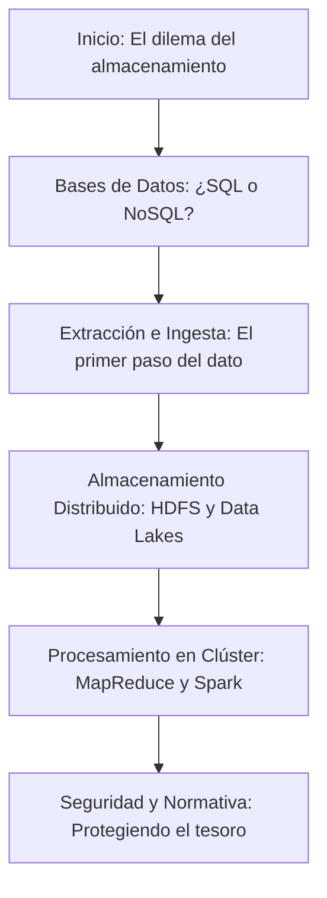

¡Bienvenido a la segunda unidad de nuestro viaje por el Big Data!

Si en la primera unidad sentamos las bases conceptuales, ahora nos arremangamos para meternos en la sala de máquinas del Big Data. ¿Alguna vez te has preguntado dónde guarda Netflix todas sus series y películas? ¿O cómo hace Google para procesar miles de millones de búsquedas en una fracción de segundo? La respuesta está en los sistemas de **almacenamiento y procesamiento distribuido**.

En esta Unidad de Trabajo, explorarás las tecnologías y estrategias que permiten a las grandes organizaciones manejar cantidades masivas de información. Dejaremos atrás los límites de un único servidor para sumergirnos en el poder de los clústeres y las bases de datos de nueva generación.

Esta unidad es fundamental para entender el "cómo" detrás del Big Data. ¡Prepárate para construir los cimientos sobre los que se levantan las aplicaciones de datos más potentes del mundo!

## Mapa de la Unidad: Tu Ruta de Aprendizaje

Aquí tienes un esquema visual de los conceptos que dominaremos en esta unidad. Cada pieza es un engranaje clave en la maquinaria del Big Data.

## Contenidos de la Unidad

Este es el desglose de los temas que abordaremos, diseñados para que comprendas cómo se gestionan los datos a gran escala:

- **Bases de Datos SQL vs. NoSQL**: Entenderás las diferencias fundamentales entre las bases de datos relacionales tradicionales y las modernas bases de datos NoSQL, y cuándo usar cada una.
- **Extracción e Ingesta de Datos**: Descubrirás las técnicas y herramientas para recolectar datos de múltiples fuentes (APIs, logs, bases de datos) y cargarlos en tu sistema de Big Data.
- **Almacenamiento Distribuido**: Profundizarás en sistemas como HDFS (Hadoop Distributed File System), la base del almacenamiento a gran escala, y conceptos como los Data Lakes.
- **Procesamiento en Clúster**: Aprenderás cómo frameworks como Hadoop MapReduce y Apache Spark distribuyen las tareas de procesamiento en múltiples máquinas para lograr una velocidad y escala sin precedentes.
- **Normativa y Seguridad**: Conocerás la importancia de proteger los datos, cumpliendo con regulaciones como el RGPD, y las estrategias para asegurar un entorno Big Data.

## Práctica de la Unidad

- **Actividades**: Ejercicios prácticos para diferenciar bases de datos, diseñar un proceso de ingesta y entender el procesamiento distribuido.
- **Tareas**: Pondrás en práctica lo aprendido configurando y utilizando herramientas del ecosistema Hadoop/Spark.

## Recursos Adicionales

- **Glosario**: Un compendio de términos técnicos para que no te pierdas en la jerga del almacenamiento y procesamiento de datos.